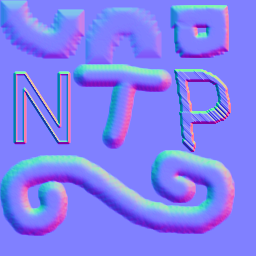
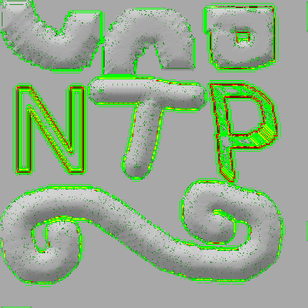
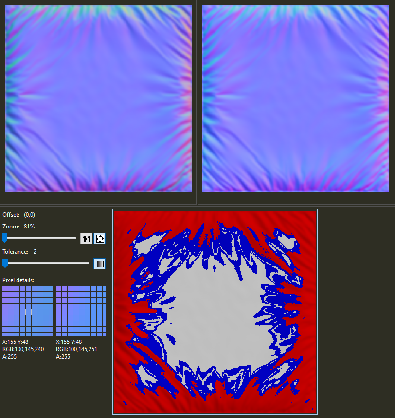
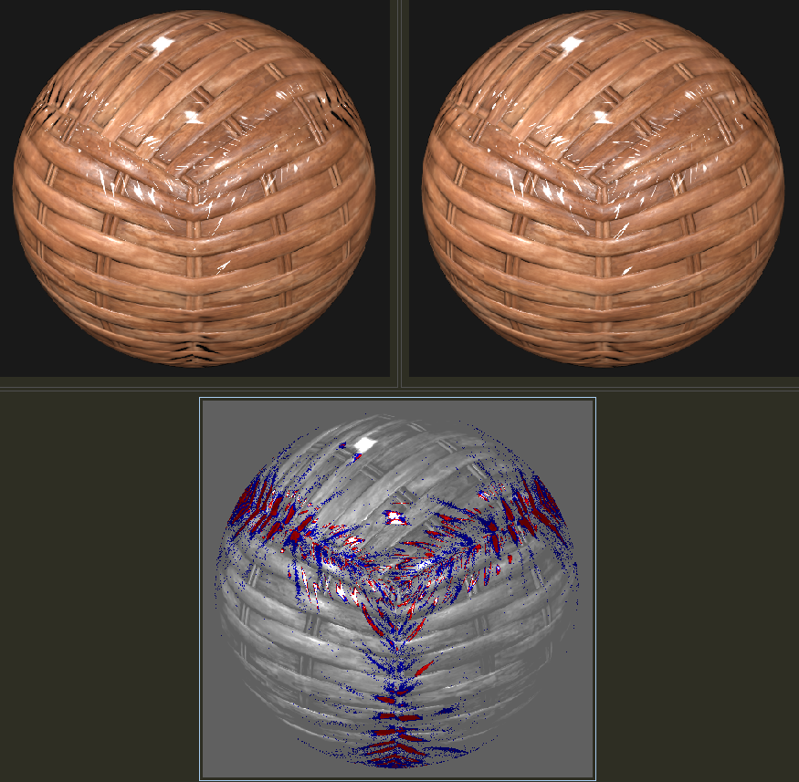
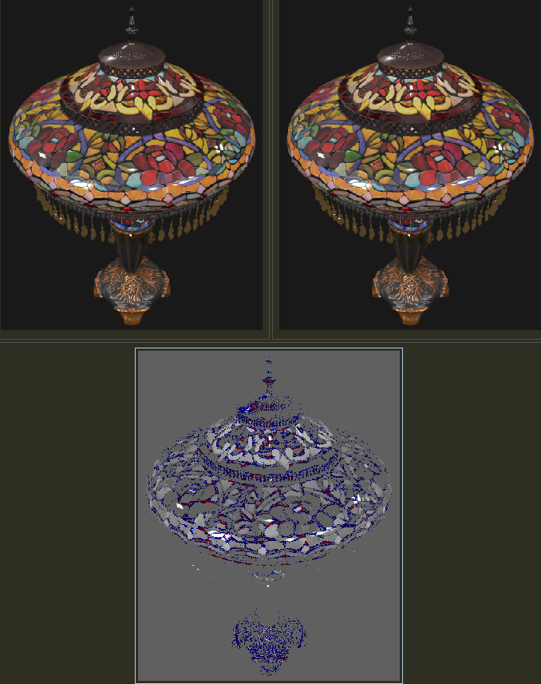

# NormalTextureProcessor (aka NTP)

## Description

This C++ project examines normals textures (i.e., textures for applying bumps to surfaces), checking them for validity, and cleaning them up or converting them as desired.



A considerable percentage of normals textures examined have badly computed Z (and sometimes X and Y) values. In practice I recommend always deriving Z from X and Y in your shaders. However, if you nonetheless want to store XYZ triplets with proper Z values, use this program to clean up your normals textures.

## Installation

Develop on Windows 10 on Visual Studio 2022 (double-click NormalTextureProcessor.sln, build Release version). You might be able to compile and run it elsewhere, as the program is pretty Windows-free and is purely command-line driven, with no graphical user interface.

The executable is available for download, [zip file here](https://www.realtimerendering.com/erich/download/NormalTextureProcessor.zip). Last updated March 6, 2024.

## Usage

This system has a few major functions: analyze normals textures for what type and how good a normals texture they are, clean up textures that have problems, and convert from one normals texture type to another. Currently the system is limited to reading in 8-bit PNG and TGA (Targa) textures. 16-bit PNG images can be read in, but are currently converted to 8 bits. To avoid name collisions with PNGs, Targa files read in and manipulated are output with the suffix "_TGA" added to the input file name, output as PNGs. JPEG is not supported, and I warn against using it unless forced, as its lossy compression is almost guaranteed to generate RGB's that convert to XYZ's that are not normalized.

A fussy note on terminology: I use the term "normals texture" for any (usually blue-ish) texture that stores normal directions as RGB (or just RG) values. "Normal texture" can be confusing - what's an "abnormal texture"? I avoid the word "map" and always use "texture," but you'll see "normal map" commonly used instead of "normal texture" elsewhere. Technically, the "map" is how the texture is applied to a surface, a separate function irrelevant here. Various analysis messages in the program talk about "one level" or "two levels", which refers to 8-bit values. For example, if a blue channel value was expected to be 228 but was 230, that is two levels of difference.

To list out all the command-line options, simply don't put any:
```sh
NormalTextureProcessor.exe
```

### Test Suite

After building the Release version, you should be able to go into the **test_files** directory and double-click on **run_test_suite.bat**. As the [README in that directory](https://github.com/erich666/NormalTextureProcessor/tree/main/test_files) notes, running this test file will create various separate output directories where the results are put. You can look at **run_test_suite.bat** to see various options in use and look at the resulting files.

### Analysis

This list of options will be confusing, so here are some typical combinations. To analyze all PNG and TGA textures in the current directory:
```sh
NormalTextureProcessor.exe -a -v
```
The '-v' is optional. It means "verbose", giving you additional information during processing. I recommend trying it on and off to see what you're missing.

A report is generated. At the end of the report the various files are output in separate categories, such as "pristine", "nearly right", etc. These lists can be used to copy and paste the list of files into the program itself, e.g.:
```sh
NormalTextureProcessor.exe -a beehive_normal.png cakestand_n.png
```
By putting specific files on the command line, the program processes only them. This example doesn't do much, just analyzes the (already analyzed) set of files again. The point is that you can specify individual files for other operations, such as cleanup and conversion.

You can also feed in an input directory:
```sh
NormalTextureProcessor.exe -a -idir flora/materials/normal_textures
```

There are three main types of normals textures this program recognizes. They are:
* RGB "standard" normals textures: each color channel is interpreted as representing numbers that go from -1.0 to 1.0, for all channels.
* RGB normal, "Z-zero": as above, but the blue, Z, channel is instead interpreted as going from 0.0 to 1.0.
* heightfield texture: an elevation texture, usually a grayscale image, typically with black representing the lowest elevation and white the highest.

The first type, where Z goes from -1 to 1, is the type that is the most popular nowadays, from what I've seen. Usually this texture is applied to a surface, so that the normals on the texture are relative to the interpolated (shading) normal of the surface itself. So, for example, a curved surface made of polygons is rendered. At a given surface location (typically) the shading normal is interpolated from vertex normals, defining the normal (Z) direction of the surface, along with X and Y basis vectors. This is known as ["tangent space"](https://80.lv/articles/tutorial-types-of-normal-maps-common-problems/). The normal is retrieved from the normals texture and modifies the surface normal.

This first type has a few variants to it. One is that Y direction on the texture can be up or down. That is, the normals texture can be thought of as "X to the right, Y up" for how its normal is interpreted. A normal of, say, (0.2, 0.3, 0.933) can be thought of as pointing 0.2 to the right, 0.3 up. That is the OpenGL interpretation. The normal's Y direction could also be considered as pointing down, i.e., think of the upper left corner as the origin and Y pointing down. This is the DirectX interpretation. See [this page](https://github.com/usd-wg/assets/tree/main/test_assets/NormalsTextureBiasAndScale) for more information and examples, and search [this page](https://80.lv/articles/tutorial-types-of-normal-maps-common-problems/) for "invert" for a wider view. OpenGL and DirectX are two major different forms you'll run across, i.e., no one reverses the X direction normally. If you use the wrong type of texture in a renderer you will see artifacts such as objects looking like they're being lit from below, for example. The glTF file format requires the OpenGL style normals texture, USD assumes OpenGL but can use scale and bias settings to support DirectX. Currently the analysis program does not have code to tell OpenGL-style files from DirectX-style files. I have some ideas how to guess using statistics as to which format a normals texture is, but haven't examined the problem yet.

For this first type, all (8-bit) values map from value 0 through 255 to the range -1.0 to 1.0. However, if you think about putting normals on a surface, a value where Z is less than 0.0 makes little sense. It would define a normal pointing into the surface, but the surface itself is at best thought of as a displaced heightfield (faked by using a normals texture instead), so there should not be any overhangs or other geometry where the Z value could go negative. One of the checks the analysis mode "-a" does is checks if the Z value is ever lower than 0.0. If it does, this is flagged as a problem.

The second type of normals texture, what I call "Z-zero", maps the 0 to 255 8-bit blue channel value to the range 0.0 to 1.0, instead of -1.0 to 1.0. There then can be no negative values for Z, and the precision of the Z value can be one bit higher. This all sounds good, but this format is (in my experience) now rarely seen. If anyone understands this evolutionary step, let me know. The reality is that this format is not supported in glTF, though can be supported in USD by using bias and scale values. Again, see [this page](https://github.com/usd-wg/assets/tree/main/test_assets/NormalsTextureBiasAndScale) for examples and more information. It is difficult to simply look at a "Z-zero" texture and tell it apart from a normals texture of the (now-popular) first type. By analyzing the Z values of the input texture and seeing whether they are negative and, more importantly, whether the (X,Y,Z) triplet formed has a vector length of nearly 1.0, we can usually tell these two types apart. That is, the program tries both conversions, standard and Z-zero, and sees which of the two normals formed is approximately 1.0 in length. This determination is the major reason this program exists, as sometimes incorrect textures slip through into test suites.

Another problem sometimes seen with both types of normals texture is that just the X and Y values (ignoring Z) form a vector that is longer than 1.0. This can happen due to (poor) resizing or filtering of normals textures, slightly incorrect conversion formulas, or who knows what else. The analysis notes how many (X,Y) vectors are too long.

The first two types, "standard" and "Z-zero", map red and green to X and Y in the same way, with the possible reversal of Y for the DirectX style texture. Given that Z cannot be a negative value (for most applications), some applications forego saving a Z value channel at all. The Z value is simply derived by sqrt(1.0 - (X\*X + Y\*Y)). For example, the [LabPBR Material](https://shaderlabs.org/wiki/LabPBR_Material_Standard) used for Minecraft modding specifies the texture holding normals as X and Y in red and green (in DirectX format), ambient occlusion is stored in the blue channel, and alpha holds the heightfield texture. The analyze mode attempts to identify these types of textures by looking at the Z values and see if the vector XYZ forms unit (length of 1.0) normals or if the Z's are independent values. If the latter, these normals textures are called "XY-only" textures in the analysis report.

A few heuristics are used to classify textures that don't clearly fall into a single category. The analysis will give one or more reasons why a texture is categorized as a particular type. Two tolerances, -etol and -etolxy, can be adjusted to be less or more strict as to what falls in a category. The '-etol' option specifies a percentage of normal lengths that can be a fair bit far from 1.0 before the texture is categorized as not being a standard normals texture. The '-etolxy' option gives how much the average of all of the X or Y values can vary from 0.0, which is usually the average for most normals textures formed. If these averages are off by more than 0.1 (the default), the input image may not even be an XY texture.

The third type of normals texture is a heightfield texture, often called a bump or height map. The format is usually a single channel (such as the red channel) or a grayscale image. Black is usually the lowest level, white the highest elevation. Analysis tries some basic testing to see if a texture may be a heightfield texture. Heightfield textures are often used to create normals textures, e.g., [GIMP has this functionality](https://docs.gimp.org/en/gimp-filter-normal-map.html). There is a scale (not stored in the image) that needs to be provided for the heightfield so that the conversion can be done. I have occasionally seen heightmap textures get intermingled with normals textures, so try to identify these.

You can also output a heatmap of where errors are in your input image file (except for heightfields). Specify '-oheatmap' says to make the output file show these. The red channel is set to 255 wherever the texel has X and Y values that give a vector length > 1.0. For input normals textures categorized as standard or Z-zero, the green channel shows a dark green when the texel's Z value is off by one "b" level, lighter green for two levels, and full green when 3 levels or more. The blue channel shows negative Z values for standard input normal textures, starting with 128 for slightly negative scaling up to 255 for Z stored as -1. Remember that "XY-only" normal textures can be forced to be interpreted as standard by '-izneg', which will then highlight the z differences found.

Here's an example run to generate a heatmap of the test file "r_normal_map.png" and the result:
```sh
.\x64\Release\NormalTextureProcessor.exe -idir test_files\Standard -odir test_files\output_Standard -oall -a -v -oheatmap r_normal_map.png
```


You can also dump out the bad pixels found in a file, or all pixel values and their conversions. Add the '-csve' argument to dump to the output directory a comma-separated-value file of texels that are not "perfect" (roundtrippable - see "Algorithms"), or '-csv' to dump all texel values. You also _must_ specify the input file type (-izneg|-izzero|-ixy) as the CSV file is generated as the file is read in, before any analysis. Here's an example:
```sh
.\x64\Release\NormalTextureProcessor.exe-idir test_files\Standard -odir test_files\output_Standard -oall -a -v squiggles_normalmap_online_zneg.png -izneg -csve
```
which will generate the file test_files/output_Standard/squiggles_normalmap_online_zneg.csv. The rightmost columns will show what sort of bad thing is happening with each texel: whether it's near (1 or 2 levels) or far (X) away from being an XY length below 1.0, whether Z is as expected or not, and whether the stored Z was negative.

### Cleanup and Conversion

In addition to analysis, this program cleans up and convert to different formats. Specify an output directory with '-odir _out_directory_name_'. The output file name will match the input file name, though always uses PNG for output. Be careful: if the input and output directories are the same or both are not specified (and so match), texture files will be written over in place.

Typical operations include:
* Clean up the normals in a texture. Use option '-oclean' to output only those files that need cleanup, '-oall' to output all files. Given a particular type of RGB texture, the program makes sure the normals are all properly normalized and that no Z values are negative.
  * If you want to maintain the sign of the Z value, use the '-allownegz' option.
  * If you set the input file type (-izneg|-izzero|-ixy), '-oclean' will force the cleaning and output of all files found.
* Convert between formats.
  * OpenGL to DirectX, standard to Z-zero, or vice versa. OpenGl-style is the default, use '-idx' to note that the input files are DirectX-style (does not affect heightfields), '-odx' to set that you want to output in DirectX-style.
  * To export to the Z-Zero format, where Z goes from 0 to 1 instead of -1 to 1, use '-ozzero'.
* Heightfields can be converted to RGB textures of any type, using the options above.
  * To force all input files to be treated as heightfields, use '-ihf'.
  * To specify how the input heightfield data is scaled, use '-hfs #', where you give a scale factor. The value is 5.0 by default.
  * By default heightfields are considered to repeat, meaning that along the edges heights "off the texture" are taken from the opposite edge. TBD: do the borders wrap or are they "doubled" or something else, such as maintaining slope. '-hborder'

This cleanup process comes with a caveat: garbage in, garbage out. If your normals textures have XY values that are trustworthy and you know the Z values are wonky for some reason, this tool can properly fix the Z values. If your normals are just plain unnormalized, where X, Y, and Z are the right direction but the wrong length, this tool will not properly fix your texture, since it assumes X and Y are their proper lengths and Z was badly derived. If you do happen to learn that your textures are this way - right directions, wrong lengths - let me know and I can add an option to fix the texture's normals in this way. The program itself cannot determine which type of error is occurring, so it assumes that only the Z value is invalid.

Tools such as [BeyondCompare](https://www.scootersoftware.com/) are worthwhile for comparing the original image with its modified version. You can hover over individual texels and see how the values have changed. Here's an example diff, with the tolerance set to 2 texel levels difference in any channel; red is more, blue is equal or less, gray is no difference.



In this example, from [glTF-sample-models](https://github.com/KhronosGroup/glTF-Sample-Models/blob/main/2.0/ClearcoatWicker/glTF/clearcoat_normal.png), you can see that the more curved areas are far off. For example, texel X:155, Y:48 has an RGB value of (100,145,240). This gives an XYZ normal of (-0.216,0.137,0.882), which has a normal length of 0.918, well short of 1.0. Assuming X and Y are valid and the blue channel was formed incorrectly, we recompute Z as 0.967 to make a normal of length 1.0, which translates to a blue value of 251.

Does it matter? Using the original vs. corrected clearcoat_normal.png with the other files in the [ClearcoatWicker](https://github.com/KhronosGroup/glTF-Sample-Models/tree/main/2.0/ClearcoatWicker/glTF) test directory, using Don McCurdy's (excellent) [glTF Viewer](https://gltf-viewer.donmccurdy.com/), we get these two renderings, diff'ed:



Visually the changes are subtle. In the middle along the vertical seam the white highlight shapes are different. In the grooves along the seam at the very bottom the original image has darker ones.

In other tests, such as the [StainedGlassLamp](https://github.com/KhronosGroup/glTF-Sample-Models/tree/main/2.0/StainedGlassLamp), where the goal is to accurately capture the real-world model, fixing the four normals textures for this model also results in slightly different renderings:



Long and short, storing the normals incorrectly is a source of error. This program can, at the minimum, tip you off when your normals are not normalized, and provide properly normalized textures by correcting the Z values.

## Algorithms

The key thing is to get the conversion right. Here's how to go from an 8-bit color channel value "rgb" to the floating point range -1.0 to 1.0 for "xyz":
```sh
x = ((float)r / 255.0f) * 2.0f - 1.0f;
y = ((float)g / 255.0f) * 2.0f - 1.0f;
z = ((float)b / 255.0f) * 2.0f - 1.0f;
```
In [UsdPreviewSurface](https://openusd.org/release/spec_usdpreviewsurface.html#texture-reader) terms, the 2.0f is the scale, the -1.0f is the bias. Note that the RGB triplet is assumed to map directly to linear values -1.0 through 1.0, there's no sRGB version or similar. In other words, the data is considered to be "just numbers" and not some gamma-corrected color.

If you want to go to the range 0.0 to 1.0, it's simpler still. Here's Z:
```sh
z = (float)(b) / 255.0f
```

If you want to compute Z from X and Y, it's:
```sh
z = sqrt(1.0f - (x * x + y * y));
```
In practice I recommend always deriving Z from X and Y in your shaders, even if Z is available, as a considerable percentage of normals textures examined often have bad Z (blue) values stored.

Getting the rounding right for the return trip is important. Here's that:
```sh
r = (unsigned char)(((x + 1.0f)/2.0f)*255.0f + 0.5f);
g = (unsigned char)(((y + 1.0f)/2.0f)*255.0f + 0.5f);
b = (unsigned char)(((z + 1.0f)/2.0f)*255.0f + 0.5f);
```
The final 0.5f rounding value on each line is important for consistency of conversion, to make roundtripping work properly.

The code above shows where the bias of 1.0 and scale of 2.0 are applied. The equations can be rearranged to:
```sh
r = (unsigned char)((0.5f*x + 0.5f)*255.0f + 0.5f);
g = (unsigned char)((0.5f*x + 0.5f)*255.0f + 0.5f);
b = (unsigned char)((0.5f*x + 0.5f)*255.0f + 0.5f);
```

For Z-zero to the blue channel, the conversion is simply:
```sh
b = (unsigned char)(z*255.0f + 0.5f);
```

See the code in the SCRATCHPAD section of NormalTextureProcessor.cpp for a roundtrip test and other procedures.

This program aims to make it so that rgb -> xy -> derive z from xy -> rgb will give the same rgb's. This is not a given. For example, say you have computed an XYZ triplet:
```sh
x = -0.423667967
y = 0.271147490
z = 0.864282646
```
This vector has a length of 0.99999999988 - very close to 1.0. The Z value is quite precise

If you convert each channel directly to 8-bit rgb, you get:
```sh
r = 73    // actually 73.9823342075, drop the fraction
g = 162   // 162.571304975, drop the fraction
b = 238   // 238.196037365, drop the fraction
```
Convert rgb back to XYZ, you get similar values to those found before, but not quite the same:
```sh
x = -0.4274509   // a little higher magnitude than -0.423667967
y = 0.2705882    // a tiny bit lower than 0.271147490
z = 0.8666666    // a bit higher than 0.864282646
```
The vector formed is also less precise, 1.0035154. This is to be expected with 8-bit numbers representing XYZ values. Say we immediately convert this xyz back to rgb:
```sh
r = 73   // in fact, 73.50001025, drop the fraction, right in the middle of the unsigned char
g = 162  // 162.4999955, drop the fraction
b = 238  // 238.4999915, drop the fraction. Came from converting z=0.8666666
```
No surprise, each floating point value is right in the middle of the "range" for each RGB value, with each fraction being near 0.5. This is a good reality check that our functions for rgb -> xyz and xyz -> rgb are solid in their own right.

The problem happens if we now derive Z from x and y, instead of using the converted z value of 0.8666666:
```sh
z = sqrt(1.0 - (-0.4274509*-0.4274509 + 0.2705882*0.2705882))
z = 0.8625936   // different than 0.8666666 saved in the b channel
```

Converting this xyz, with the new z value computed from the new vector length, back to rgb, we get:
```sh
r = 73   // again 73.50001025
g = 162  // again 162.4999955
b = 237  // 237.980684, dropping the fraction gives 237
```
This b value is one level less than the original 238 we computed for it. This difference happens because we lose precision converting from xyz to rgb the first time, so that when we convert from rgb the second time and then compute Z from X and Y, the X and Y being different causes Z to be enough different that it changes a level.

What is interesting at this point is that "rgb -> xy -> derive z from xy -> rgb" is now stable. The values "rg" never change, so X and Y don't change, so the Z derived from them is also the same, giving the same "b" value when converted back. With b=237, Z is 0.8588235. The normal length of this new XYZ is 0.9967497, which is in this case ever so slightly better than 1.0035154 (it's 0.0032503 away from 1.0, vs. 0.0035154).

What roundtripping implies is that the length of the normal being close to 1.0 is the metric that controls things. If you convert r and g to X and Y, then use these to compute Z and convert to "b", you have the same "b", a "b" that gives a normal as close as possible to 1.0, given r and g. The alternative is to treat X, Y, and Z as entirely separate channels having nothing to do with each other once we have the values in floating point. However, doing so means round-tripping doesn't work. This in turn means (admittedly usually tiny) differences with shaders: one shader uses Z computed from the stored b, another uses Z computed from r and g, and these Z's are sometimes off by a texel level.

This program aims to provide stable rgb triplets, ones where if the Z value is derived from X and Y, the "b" value is the same as the original value. Internally, this means that we always derive the Z value from the 8-bit r and g values, as shown, so that the result "b" value is the same as the derived "b". When reading in normals rgb textures, the program always derives the Z value as explained, so gives consistent results. That is, if you clean up a normals texture, the program's clean image will not change if you clean it again. Where this principle affects the code a bit more is when using a heightfield to compute an XYZ normal. As shown above, to make a roundtrippable rgb triplet, we have to convert XY to rg, then rg back to let's call it XY', the XY values that come from the 8-bit precision r and g values. Then Z is computed as usual and the b value created from it.

## Resources

Some resources I've found useful:
* [Normalmap Online](https://cpetry.github.io/NormalMap-Online/), [github](https://github.com/cpetry/NormalMap-Online) - a web-based normal map creation tool, it takes heightfields and converts to normals textures. By default, Z is mapped from 0 to 1 (old style), but there is a "Z Range" option (that I helped add) that lets you choose -1 to 1. A bit confusing, but what you do is click on the "wavy rings" heightmap image itself. A file dialog comes up and you load your own image. You can then see the RGB texture formed, and the texture applied to a cube in the right. Mouse-drag to change the view of the cube. Lots of options, including true displacement, so you can see the difference between that and just normals textures. Note: the precision of the conversion is not perfect, with some computed normal lengths varying up to four levels from the correct answer.
* [USD Normals Texture Bias And Scale](https://github.com/usd-wg/assets/tree/main/test_assets/NormalsTextureBiasAndScale) - a set of test normals textures of different types in a USD file, along with copious documentation of how each cube is formed. I made this test.
* [UsdPreviewSurface](https://openusd.org/release/spec_usdpreviewsurface.html#texture-reader) - the USD specification's basic material. Search on "normal3f" to see more about how to specify it.
* [glTF 2.0 specification](https://registry.khronos.org/glTF/specs/2.0/glTF-2.0.html) - has much about normals textures.
* [GIMP conversion](https://docs.gimp.org/en/gimp-filter-normal-map.html) - how to make normals textures from heightfields in GIMP.
* [_Survey of Efficient Representations for Independent Unit Vectors_|https://jcgt.org/published/0003/02/01/] - Storing normals as XYZ triplets is wasteful, since Z could just be computed from X and Y in most usages. Even storing just X and Y gives pairs of numbers that are unusable, forming vectors longer than 1.0, and the precision is poorly distributed for the rest. This paper and code gives some better alternate representations.

## License

MIT license. See the [LICENSE](https://github.com/erich666/NormalTextureProcessor/blob/main/LICENSE) file in this directory.

## Acknowledgements

Thanks to Nick Porcino for the quick check on my conversion equations. Thanks to Koen Vroeijenstijn for discussions about 16-bit PNG formats, and John Stone for even higher precision representations.

## Roadmap

Potential tasks (no promises!):

- [ ] Figure out way (if any) to tell if a texture is OpenGL or DirectX oriented. I suspect there's some curvature analysis, perhaps converting into a heightfield, that could be done. For example, take differences between texels horizontally and vertically and see the correspondence - bumps are more likely than hyperboloids. Or maybe it's not possible (well, it certainly isn't if there's no Y variance).
- [ ] Convert back from normals textures to heightfields. Not sure this is useful (nor how to do it, exactly), but might be worth adding, for visualization and analysis.
- [ ] Ignore texels that are black or white (probably unused in texture, except for heightfields). Adjust statistics, CSV output, etc.
- [ ] Support 16-bit PNG files fully, input and output. Also properly convert channel values that have less than 8 bits.
- [ ] Ignore pixels with alpha values of 0.
