# Normal Map test files

Execute **run_test_suite.bat** on Windows to analyze and convert/clean-up the texture test files in this directory and subdirectories. Running this test file will create various separate output directories where the results are put.

## Directories
* Standard - standard RGB -> XYZ, where Z is -1 to 1 range
* XYtextures - RG -> XY, and Z is something else (like ambient occlusion, e.g., LabPBR)
* ZZero - RGB -> XYZ, but Z goes from 0 to 1 instead of -1 to 1
* Heightfields - heightfield test images
* NoneOfTheAbove - other test images of various sorts

Each directory's contents:

### Standard

lava_flow_n.png - a file with almost no bumps, all nearly the same value. File is from the [jg-rtx](https://github.com/jasonjgardner/jg-rtx) resource pack for Minecraft, license [CC-NC-BY-SA](https://github.com/jasonjgardner/jg-rtx/blob/main/LICENSE).

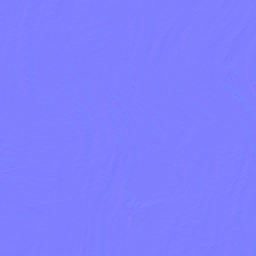

r_normal_map.png - letter R squiggles (see Heightfields directory) in standard form. Not quite correct, making it a good test. From the [USD Assets Working Group](https://github.com/usd-wg/assets/tree/main/test_assets/NormalsTextureBiasAndScale) Normals Texture Bias And Scale test, license CC-NC-BY-SA.

r_normal_map_reversed_y.png - letter R in standard form, DirectX orientation. Not quite correct, making it a good test. From the [USD Assets Working Group](https://github.com/usd-wg/assets/tree/main/test_assets/NormalsTextureBiasAndScale) Normals Texture Bias And Scale test, license CC-NC-BY-SA.

squiggles_gimp.png - squiggles (see Heightfields directory) converted using [GIMP](https://www.gimp.org/) using [these instructions](https://docs.gimp.org/en/gimp-filter-normal-map.html). GIMP evidently uses the DirectX style for output by default, though has a "Flip Y" and other options to adjust the style.

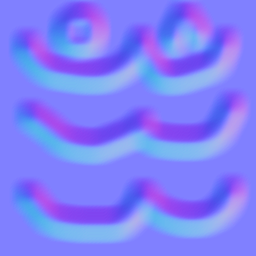

squiggles_normalmap_online_zneg.png - converted using [NormalMap Online](https://cpetry.github.io/NormalMap-Online/), with the "Z Range -1 to +1" box checked.

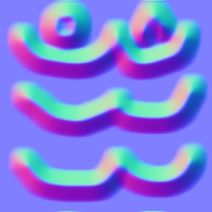

squiggles_ntp_quick.png - converted by an earlier version of the NormalTextureProcessor.exe's heightfield converter, but without adjusting for roundtripping. Some pixels have one-level differences with squiggles_ntp_roundtrip.png. Use a "diff" program such as Beyond Compare to see the differences between the two. Note if you read this file in and convert it, the result should be the same as squiggles_ntp_roundtrip.png.

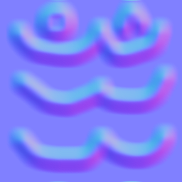

squiggles_ntp_roundtrip.png - converted by NormalTextureProcessor.exe's heightfield converter using roundtripping. If you try to clean this file, nothing should happen, since all the texels are perfectly roundtrippable (see Algorithms section on the main page).

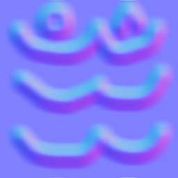

targa_r_normal_map.tga - same as r_normal_map.png, the letter R in standard form. Test that Targa input works. Converted from the [USD Assets Working Group](https://github.com/usd-wg/assets/tree/main/test_assets/NormalsTextureBiasAndScale) Normals Texture Bias And Scale test, license CC-NC-BY-SA.

### XYtextures

acacia_door_bottom_n.png - the blue channel is ambient occlusion, [LabPBR format](https://shaderlabs.org/wiki/LabPBR_Material_Standard). File is from the [jg-rtx](https://github.com/jasonjgardner/jg-rtx) resource pack for Minecraft, license [CC-NC-BY-SA](https://github.com/jasonjgardner/jg-rtx/blob/main/LICENSE).

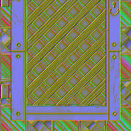

### ZZero

r_normal_map_reversed_x_0_bias_z.png - letter R in Z-Zero form, and the X axis is reversed (non-standard, just meant as a test). Not quite correct, making it a good test. From the [USD Assets Working Group](https://github.com/usd-wg/assets/tree/main/test_assets/NormalsTextureBiasAndScale) Normals Texture Bias And Scale test, license CC-NC-BY-SA.

squiggles_normalmap_online_zzero.png - converted using [NormalMap Online](https://cpetry.github.io/NormalMap-Online/).

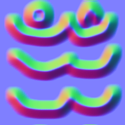

### Heightfields

grayscale_wood_floor.png - grayscale wood floor sample, non-tiling.

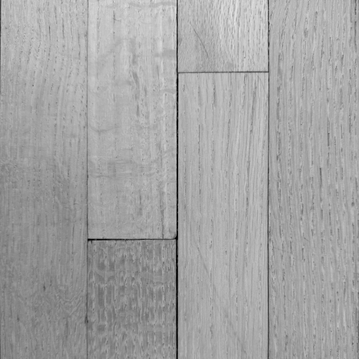

ntp_heightfield.png - text and brushes heightfield, giving a wide variety of slopes 

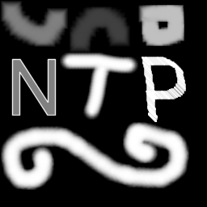

r_bump_map.png - grayscale letter R. From the [USD Assets Working Group](https://github.com/usd-wg/assets/tree/main/test_assets/NormalsTextureBiasAndScale) Normals Texture Bias And Scale test, license CC-NC-BY-SA.

squiggles.png - brushstrokes of similar slopes

### NoneOfTheAbove

black.tga - all black, as a test. Non-power-of-two non-square size.

cyan.png - solid cyan, as a test.

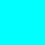

gray.png - a neutral gray, as a test. Non-power-of-two non-square size.

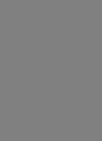

white.tga - all white, as a test.

wood_floor.png - colored wood floor sample, non-tiling.

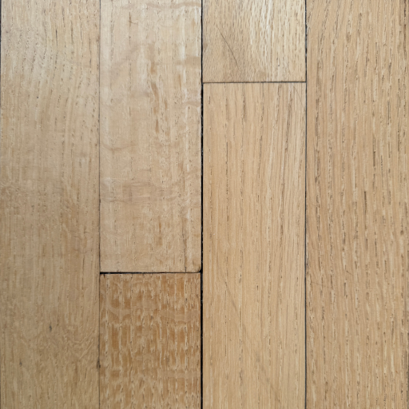

yellow.png - solid yellow, as a test.

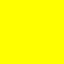

## License

For images, license is [CC-NC-BY-SA](https://github.com/erich666/NormalTextureProcessor/test_files/LICENSE), unless noted otherwise above.